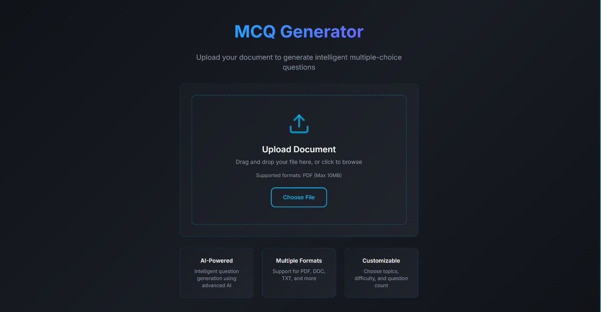
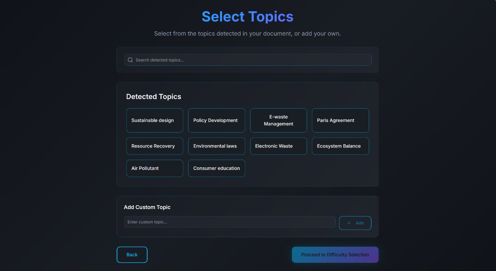
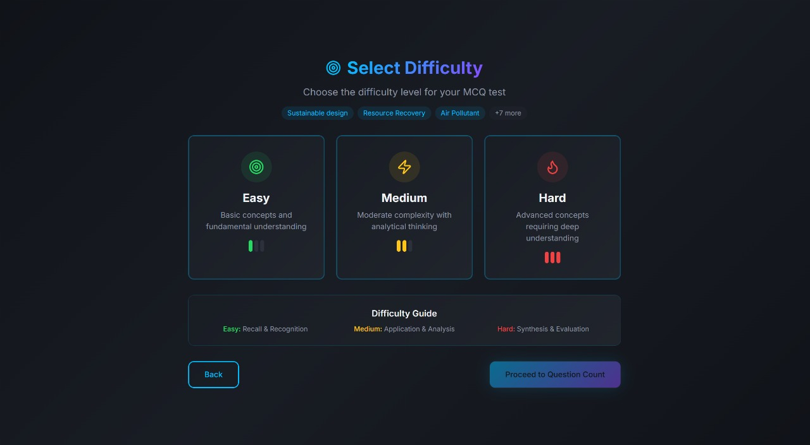
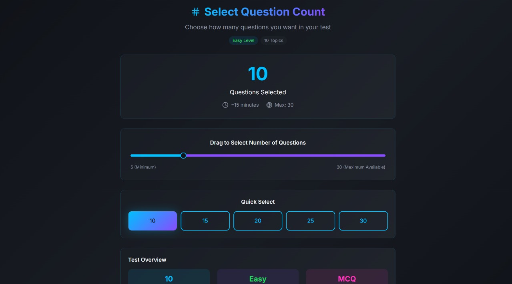
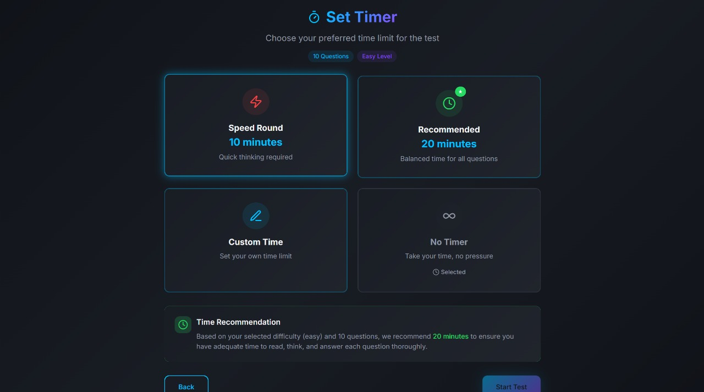
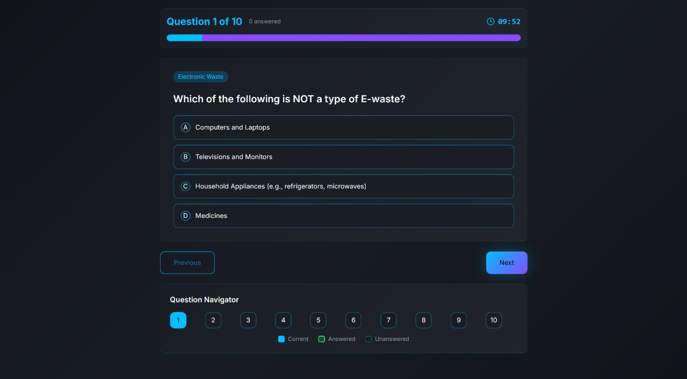
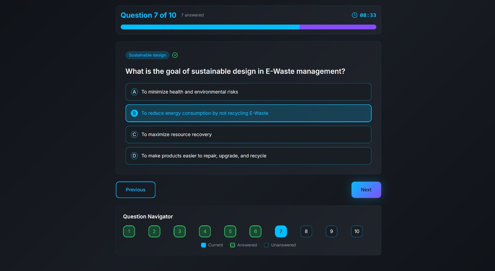
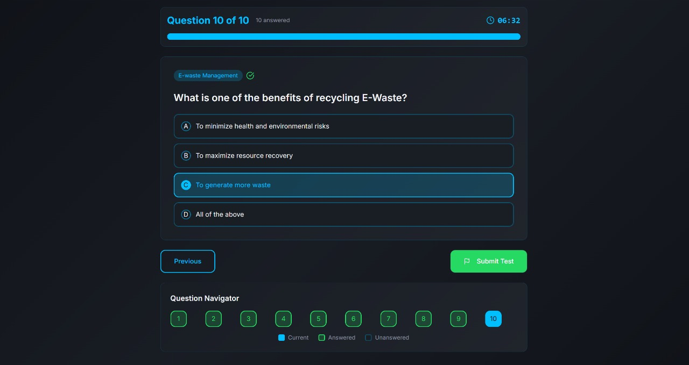

# Hackathors - AI-Powered MCQ Generator

An intelligent web application that automatically generates Multiple Choice Questions (MCQs) from PDF documents using AI. Built for the PISB Hackathon, this tool helps educators and students create practice tests from their study materials.

## 🚀 Features

- **PDF Text Extraction**: Automatically extracts text content from uploaded PDF files
- **Topic Detection**: AI-powered topic extraction from document content
- **Smart MCQ Generation**: Generates contextually relevant questions using local AI models
- **Customizable Difficulty**: Choose from Easy, Medium, and Hard difficulty levels
- **Flexible Question Count**: Generate 1-50 questions per session
- **Timer Support**: Optional timed test sessions
- **Interactive Test Interface**: Clean, modern UI for taking generated tests
- **Instant Results**: Immediate scoring and detailed explanations
- **Responsive Design**: Works seamlessly on desktop and mobile devices

## 🏗️ Architecture

This project consists of two main components:

### Backend (FastAPI + Python)
- **FastAPI** server for RESTful API endpoints
- **PDF Processing** using PyMuPDF for text extraction
- **AI Models** using Ollama (phi3 and llama3.1) for topic extraction and MCQ generation

### Frontend (React + TypeScript)
- **React 18** with TypeScript for type safety
- **Vite** for fast development and building
- **Tailwind CSS** for styling
- **Shadcn/ui** components for modern UI
- **React Router** for navigation
- **React Query** for API state management

## 📋 Prerequisites

Before running this project, ensure you have the following installed:

- **Node.js** (v18 or higher)
- **Python** (v3.8 or higher)
- **Ollama** (for local AI models)
- **Git** (for cloning the repository)

## 🛠️ Installation

### 1. Clone the Repository
```bash
git clone <repository-url>
cd Hackathors
```

### 2. Install Ollama Models
```bash
# Install the required AI models
ollama pull phi3
ollama pull llama3.1
```

### 3. Quick Start (Recommended)
Use the provided script to start both backend and frontend simultaneously:
```bash
chmod +x run_all.sh
./run_all.sh
```

This will:
- Start the FastAPI backend on `http://localhost:8000`
- Start the React frontend on `http://localhost:5173`
- Launch the required Ollama AI models

### 4. Manual Setup (Alternative)

#### Backend Setup
```bash
cd backend

# Create virtual environment (optional but recommended)
python3 -m venv .venv
source .venv/bin/activate  # On Windows: .venv\Scripts\activate

# Install dependencies
pip install -r requirements.txt

# Start the server
chmod +x start.sh
./start.sh
```

#### Frontend Setup
```bash
cd frontend

# Install dependencies
npm install

# Start development server
chmod +x start.sh
./start.sh
```

## 🎯 Usage

### 1. Upload PDF
- Navigate to the application in your browser
- Click "Choose File" to upload a PDF document
- Supported formats: PDF files with text content

### 2. Topic Selection
- The system will automatically scan your document and extract topics
- Select the topics you want questions generated for
- You can select multiple topics or all detected topics

### 3. Configure Test Settings
- **Difficulty Level**: Choose Easy, Medium, or Hard
- **Question Count**: Select between 1-50 questions
- **Timer**: Optionally set a time limit for the test

### 4. Take the Test
- Review each question and select your answer
- Navigate between questions using the interface
- Submit when finished or when time runs out

### 5. View Results
- See your score and performance
- Review correct answers and explanations
- Option to restart with new settings

## 🔧 API Endpoints

### Extract Topics
```
POST /extract-topics/
Content-Type: multipart/form-data

Parameters:
- file: PDF file upload
```

### Generate Questions
```
POST /generate-questions/
Content-Type: multipart/form-data

Parameters:
- topics: JSON string or comma-separated list
- difficulty: "easy", "medium", or "hard"
- num_questions: integer (1-50)
```

## 📸 Screenshots

Add images to `docs/screenshots/` and they will render here. Common formats: `.jpeg`, `.png`, `.webp`.

### Application Screens

- **Home**

  

- **Topic Selection**

  

- **Difficulty Selection**

  

- **Question Count Selection**

  

- **Timer Selection**

  

- **Question Interface**

  
  
  

- **Results Display**

  


### Project Structure
```
Hackathors/
├── docs/
│   └── screenshots/               # README images
├── backend/
│   ├── app/
│   │   ├── main.py              # FastAPI application
│   │   ├── models/              # AI models and processing
│   │   ├── routes/              # API endpoints
│   │   └── schemas/             # Data models
│   ├── requirements.txt         # Python dependencies
│   └── start.sh                 # Backend startup script
├── frontend/
│   ├── src/
│   │   ├── components/          # React components
│   │   ├── pages/               # Page components
│   │   └── App.tsx              # Main app component
│   ├── package.json             # Node.js dependencies
│   └── start.sh                 # Frontend startup script
├── testing_data/                # Sample PDF files
├── run_all.sh                   # Combined startup script
└── README.md                    # This file
```

